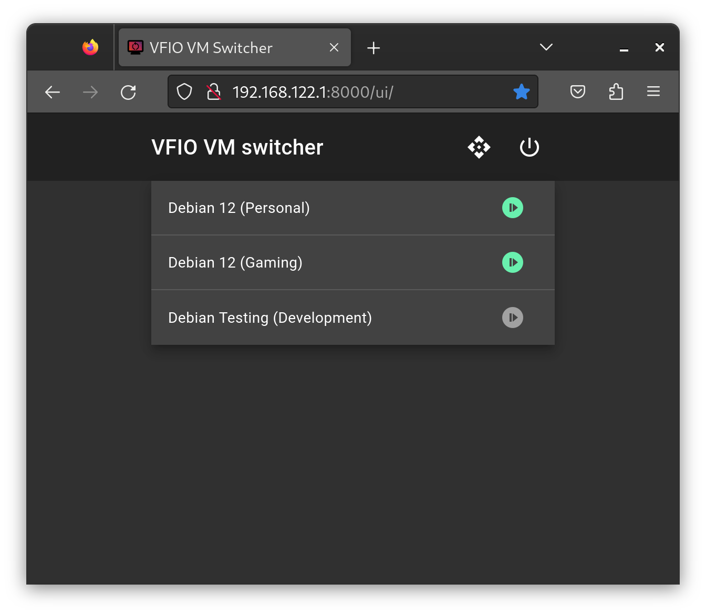

# VFIO VM Switcher

Allow control of VFIO virtual machines from within VFIO virtual machines.

This is designed for situations where you have multiple VM definitions which use the same hardware, so only one can be powered on at a time.

This repository contains a simple API which runs on the host, and allows the guest ask for itself to be shut down, and have a different VM booted up instead. This allows a user of a VM with GPU passthrough to swap to a different VM, without needing to switch mouse/keyboard/monitor input to the host operating system.

## Installation notes

Substitute the username `mike` for your own username where applicable. The script assumes you are in the `libvirt` group and can control VM's.

Build the UI first:

```bash
cd ui
npm install
npm run build
```

Next build the python bundle.

```bash
sudo apt install libvirt-dev libpython3-dev build-essential
python3 -m venv venv/
./venv/bin/pip install -r requirements.txt
./venv/bin/pyinstaller --add-data "ui/dist/:ui/dist/" --onefile app/main.py
```

App is then a binary at `./dist/main`

## Invoking API from web

When you run the app, a simple web UI becomes available on port 8000 on all interfaces. If you are using the default libvirt network, the URL to bookmark in the guests is http://192.168.122.1:8000/ui/. 

This displays a list of VM's, each with a start button next to it. When you start a VM, the host will first shut down anything else that is running, and start up the requested VM.



The other buttons power off the host, and display the API docs.

## Invoking API from command-line

Invocation via curl, list domains:

```bash
curl -Ss http://192.168.122.1:8000/api/domain
```

Ask for `testbox-2` to be booted up (everything else will be shut down first)

```bash
curl -Ss -X PATCH http://192.168.122.1:8000/api/domain/testbox-2 -H 'Content-Type: application/json' -d '{"state" : "RUNNING"}'
```

Ask for everything to be shut off, and for the host to be powered off.

```bash
curl -Ss -X PATCH http://192.168.122.1:8000/api/host -H 'Content-Type: application/json' -d '{"state" : "SHUTOFF"}'
```

Assuming that the binary is in `/opt/vm-switcher`, it may be installed by creating the following `/etc/systemd/system/vm-switcher.service`:

## Installation as service

```bash
[Unit]
Description=VM Switcher

[Service]
ExecStart=/opt/vm-switcher/main
WorkingDirectory=/opt/vm-switcher/
User=mike

[Install]
WantedBy=multi-user.target
```

```
systemctl daemon-reload
systemctl enable vm-switcher
systemctl start vm-switcher
```

Note that full root permissions are not required, though to allow the script to run `poweroff` on the host, you will also need to create `/etc/sudoers.d/00-poweroff`.

```
mike ALL=NOPASSWD: /sbin/halt, /sbin/reboot, /sbin/poweroff
```

## GNOME extension

Rudimentary GNOME integration is available via an extension, which may be installed locally by coping the `vfiovmswitcher@mike42.me` directory from `gnome-integration/` to `~/.local/share/gnome-shell/extensions/`.

This provides a panel indicator which allows quick VM switching Linux guests running GNOME 44.

## License

The VFIO VM Switcher is licensed under the GNU General Public License version 2 or later. Please see the LICENSE file in this repository for details.

Some files incorporated in this project are derived from other open source codebases:

- The favicon used for this project's web interface is derived from `blobs-l.svg` from [gnome-backgrounds], originally by Jakub Steiner, and is licensed under Creative Commons Attribution-ShareAlike 3.0 License.
- The VFIO VM switcher GNOME extension in this repository is derived from a template from the GNOME shell extensions tool (a subproject of [GNOME Shell](https://gitlab.gnome.org/GNOME/gnome-shell)), and is licensed under the GNU GPL version 2 or later.
